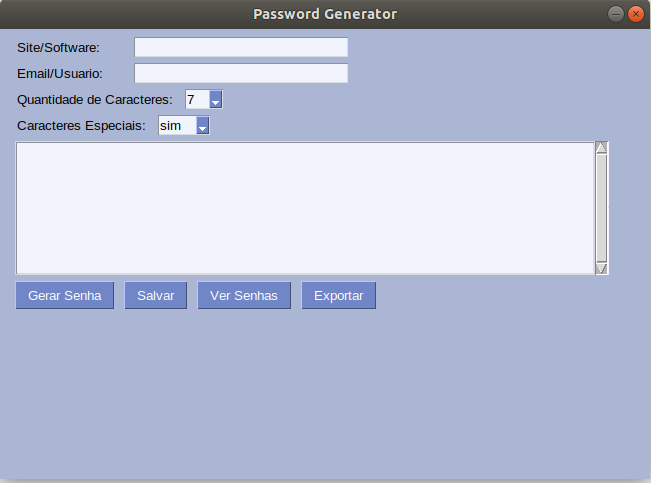

<h2 align="center">
  Gerador de Senhas 2.0
</h2>

<h3 align="center">
    
    <br>
</h3>

O projeto foi feito com a biblioteca PySimpleGUI, utiliza um banco ```sqlite``` para salvar os dados. 

Os recursos disponíveis são: 
- [x] Adicionar o site e o usuário que você vai gerar a senha.
- [x] Escolher a quantidade de caracteres do tamanho total da senha.
- [x] Poder criar senhas com ou sem caracteres especiais.
- [x] Salvar em um arquivo e ter todas as senhas geradas.

**Instalação**: É necessário ter o Python e a biblioteca PySimpleGUI, com o comando ``` pip3 install pysimplegui ``` você instala a biblioteca. ***Obs:*** Também é necessário ter o tkinter, no Ubuntu com o comando ```sudo apt-get install python3-tk```  você instala.


**Execução**: Com o comando ``` python3 pass.py ``` você executa a aplicação.
